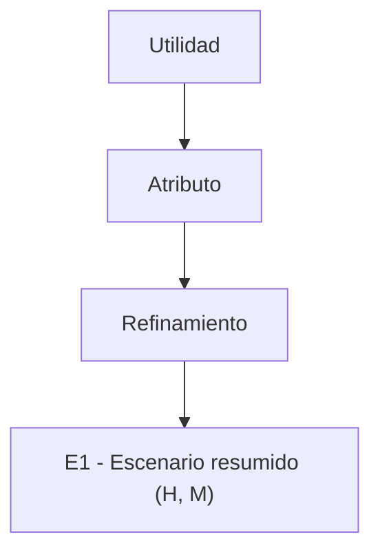
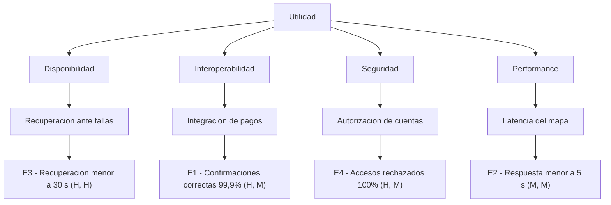

# Generador de arboles de utilidad

Organiza escenarios de atributos de calidad en un arbol de utilidad y permite visualizar
cuales son los principales drivers arquitectonicos del sistema.

## 1. Objetivo

Transformar una lista de escenarios de calidad en una estructura jerarquica que permita:

- agrupar los escenarios segun el atributo de calidad al que pertenecen;
- identificar el aspecto concreto o refinamiento que trata cada escenario;
- conservar la importancia asignada por los stakeholders;
- conservar la dificultad o riesgo tecnico estimado por el equipo;
- reconocer los escenarios que mas deben influir sobre la arquitectura.

Un arbol de utilidad no es una lista generica de propiedades deseables. Sus hojas deben
contener escenarios concretos, comprensibles y medibles.

## 2. Estructura del arbol

Construir el arbol utilizando cuatro niveles:

1. **Utilidad:** raiz unica que representa el valor total esperado del sistema para sus
   stakeholders.
2. **Atributo de calidad:** categoria principal, por ejemplo Performance, Disponibilidad,
   Seguridad, Usabilidad, Interoperabilidad o Modificabilidad.
3. **Refinamiento:** aspecto especifico del atributo que permite agrupar escenarios
   relacionados. Por ejemplo, Performance puede refinarse en "latencia de busqueda" y
   "procesamiento bajo carga"; Seguridad puede refinarse en "autorizacion" y "auditoria".
4. **Escenario:** situacion concreta y medible que constituye una hoja del arbol.

La estructura conceptual es:

```text
Utilidad
  -> Atributo de calidad
      -> Refinamiento
          -> Escenario (Importancia, Dificultad)
```

### Reglas para los refinamientos

- Derivar el refinamiento del contenido real del escenario; no usar categorias vacias o
  excesivamente generales.
- Utilizar nombres breves, por ejemplo "latencia del mapa", "recuperacion ante fallas",
  "integracion de pagos" o "proteccion del saldo".
- Agrupar bajo el mismo refinamiento solamente escenarios que describan la misma
  preocupacion de calidad.
- No confundir refinamientos con componentes del sistema. "Modulo de pagos" es un
  artefacto; "intercambio con la pasarela de pagos" es un refinamiento de
  interoperabilidad.

## 3. Priorizacion

Cada escenario debe llevar una pareja de prioridades con el formato:

```text
(Importancia, Dificultad)
```

Utilizar la escala:

- **H (High / Alta)**
- **M (Medium / Media)**
- **L (Low / Baja)**

### Importancia

Indica cuanto valor tiene el escenario para los stakeholders y cuanto afectaria al negocio
que no se cumpla. Debe provenir, siempre que sea posible, de los stakeholders.

Preguntas guia:

- ¿El incumplimiento impide utilizar una funcion central del sistema?
- ¿Puede producir perdidas economicas, legales, de seguridad o de reputacion?
- ¿Cuantos stakeholders resultan afectados?
- ¿Es indispensable para alcanzar un objetivo de negocio?

### Dificultad

Indica el esfuerzo, incertidumbre o riesgo tecnico de satisfacer el escenario. Debe
provenir, siempre que sea posible, del equipo tecnico.

Preguntas guia:

- ¿Requiere tecnologia o integraciones que el equipo no conoce?
- ¿Afecta varios componentes o decisiones arquitectonicas?
- ¿Existen dependencias externas fuera del control del equipo?
- ¿Es dificil verificar que la medida de respuesta se cumple?

### Interpretacion de las parejas

- **(H, H):** escenario de alta importancia y alta dificultad. Es un driver
  arquitectonico prioritario y una posible fuente de riesgo.
- **(H, M) o (H, L):** escenario importante que debe ser atendido, aunque su riesgo sea
  medio o bajo.
- **(M, H) o (L, H):** escenario tecnicamente complejo cuyo valor debe revisarse antes
  de invertir demasiado esfuerzo.
- **(M, M), (M, L), (L, M) o (L, L):** escenarios de prioridad comparativamente menor.

No calcular un promedio numerico entre importancia y dificultad. Las dos dimensiones
representan conceptos distintos y deben conservarse por separado.

## 4. Manejo de informacion faltante

1. **Escenario sin atributo:** inferir el atributo principal a partir del estimulo, la
   respuesta y especialmente la medida. Explicar brevemente la clasificacion.
2. **Escenario incompleto o vago:** incluirlo de manera provisoria solamente si puede
   comprenderse su preocupacion principal. Marcarlo como "requiere refinamiento" y
   recomendar revisarlo con la skill `test-qas` antes de tomar decisiones de arquitectura.
3. **Prioridades ausentes:** no presentarlas como datos confirmados. Solicitar al usuario
   la importancia y dificultad o proponer valores preliminares marcados como
   **suposiciones a validar**.
4. **Stakeholder ausente:** indicar que la importancia no puede validarse sin conocer al
   stakeholder interesado. Proponer el stakeholder mas probable solo como suposicion.
5. **Escenario relacionado con varios atributos:** ubicarlo bajo el atributo principal,
   determinado por aquello que mide la medida de respuesta. Mencionar los atributos
   secundarios en una observacion; no duplicar la misma hoja en varias ramas.

## 5. Errores frecuentes a evitar

- Crear ramas para todos los atributos de calidad conocidos aunque no existan escenarios
  relacionados con ellos.
- Colocar palabras vagas como "rapidez" o "seguridad" en las hojas en lugar de escenarios
  medibles.
- Inventar prioridades sin distinguirlas de las asignadas por stakeholders y tecnicos.
- Usar el nombre del artefacto como refinamiento.
- Duplicar un escenario bajo varios atributos.
- Alterar los valores, porcentajes o tiempos establecidos en los escenarios de entrada.
- Considerar automaticamente que todo escenario (H, H) ya esta satisfecho; la pareja solo
  indica prioridad y dificultad, no el resultado de una evaluacion.
- Construir un arbol visual ilegible, con textos demasiado extensos dentro de cada nodo.

## 6. Flujo de trabajo

1. Leer los escenarios y verificar que cada uno tenga un atributo de calidad identificable.
2. Asignar un identificador unico a cada escenario: E1, E2, E3, etc.
3. Determinar el atributo principal de cada escenario.
4. Crear un refinamiento breve que represente su preocupacion especifica.
5. Obtener o proponer la importancia y dificultad, aplicando las reglas de la seccion 4
   cuando falten datos.
6. Construir la jerarquia Utilidad -> Atributo -> Refinamiento -> Escenario.
7. Ordenar primero los escenarios de importancia alta y, entre ellos, destacar los de
   dificultad alta.
8. Verificar que todos los escenarios aparezcan exactamente una vez y que sus medidas no
   hayan sido modificadas.
9. Entregar la tabla de priorizacion, el arbol y el analisis de drivers arquitectonicos.

## 7. Estructura de la respuesta

Responder utilizando este orden:

### 1. Tabla de escenarios y prioridades

| ID | Atributo | Refinamiento | Escenario resumido | Stakeholder | Prioridad (I, D) |
|---|---|---|---|---|---|
| E1 | ... | ... | ... | ... | (H, M) |

El resumen debe conservar el estimulo, la respuesta y la medida de respuesta. Los detalles
que no entren comodamente en la tabla pueden explicarse debajo.

### 2. Arbol de utilidad

Generar un diagrama Mermaid con direccion vertical. Utilizar identificadores simples en
los nodos y textos breves para evitar errores de renderizado.



Si el entorno no puede renderizar Mermaid, entregar adicionalmente la misma jerarquia
como lista Markdown anidada.

### 3. Drivers arquitectonicos

Enumerar primero los escenarios (H, H) y explicar por que combinan alto valor y alto riesgo.
Si no existen escenarios (H, H), indicar cuales son los de mayor importancia disponible.

### 4. Suposiciones y datos a validar

Separar claramente:

- prioridades proporcionadas por el usuario;
- prioridades propuestas por la skill;
- escenarios que requieren refinamiento;
- stakeholders que deben confirmar la importancia.

## 8. Ejemplo de referencia

### Input

Sistema de alquiler de monopatines:

- **E1 - Interoperabilidad:** cuando Mercado Pago envia la confirmacion de una
  acreditacion, el modulo de pagos actualiza correctamente el saldo. El 99,9% de las
  confirmaciones validas se procesa sin perdida ni duplicacion. Stakeholders: titular de
  la cuenta y empresa. Prioridad: (H, M).
- **E2 - Performance:** cuando un usuario abre el mapa durante la operacion normal, la
  aplicacion muestra las paradas disponibles. El 95% de las solicitudes se completa en
  menos de 5 segundos. Stakeholder: usuario. Prioridad: (M, M).
- **E3 - Disponibilidad:** si el servidor principal deja de responder mientras existen
  viajes activos, el servicio se recupera en menos de 30 segundos sin perder viajes ni
  duplicar cobros. Stakeholders: usuarios y empresa. Prioridad: (H, H).
- **E4 - Seguridad:** cuando un usuario intenta consultar una cuenta para la que no esta
  autorizado, el sistema rechaza y registra el acceso. El 100% de las solicitudes no
  autorizadas se rechaza sin exponer informacion. Stakeholders: titular y empresa.
  Prioridad: (H, M).

### Output

#### Tabla de escenarios y prioridades

| ID | Atributo | Refinamiento | Escenario resumido | Stakeholder | Prioridad (I, D) |
|---|---|---|---|---|---|
| E3 | Disponibilidad | Recuperacion ante fallas | Recuperar el servicio en menos de 30 segundos sin perder viajes ni duplicar cobros | Usuarios y empresa | (H, H) |
| E1 | Interoperabilidad | Integracion de pagos | Procesar correctamente el 99,9% de las confirmaciones validas de Mercado Pago | Titular y empresa | (H, M) |
| E4 | Seguridad | Autorizacion de cuentas | Rechazar y registrar el 100% de los accesos sin autorizacion | Titular y empresa | (H, M) |
| E2 | Performance | Latencia del mapa | Mostrar el mapa en menos de 5 segundos para el 95% de las solicitudes | Usuario | (M, M) |

#### Arbol de utilidad



#### Drivers arquitectonicos

- **E3 - Disponibilidad (H, H):** es el principal driver porque afecta viajes y cobros
  activos y, al mismo tiempo, exige recuperacion rapida sin perdida ni duplicacion de
  informacion.

#### Suposiciones y datos a validar

No se introdujeron prioridades nuevas: todas fueron proporcionadas en la entrada. Debe
validarse con los stakeholders que E2 tenga efectivamente importancia media.
